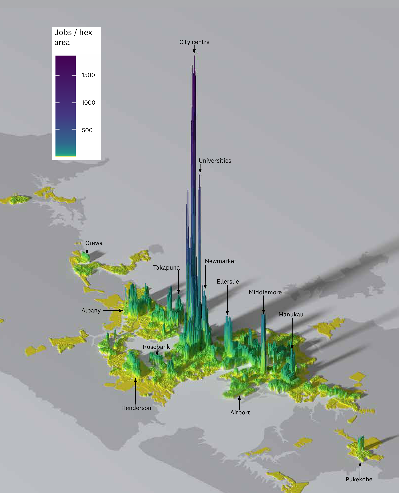

**Document status**

| Document history |  |  |
|---|---|---|
| Status | Commencement date | Alterations |
| Version 0.6 | July 2026 | Version control established |
| Version 0.7 | July 2026 | Central evidence section restructured |
| Version 0.8 | July 2026 | Parallel Word and Markdown versions instituted; trans-Tasman migration channel added (5.1); skills mismatch evidence added (5.4); Nunns (2019) and OECD (2016) added to bibliography; duplicate section numbering corrected (Conclusion now 11); Section 7 (New Zealand's Final Frontier) drafted and referenced; Section 6 (political economy) redrafted |
| Version 0.9 | July 2026 | Sections 8, 9, exec summary drafted; reference sweep — citations resolved in 3.7, 3.9, 5.5, 5.8; Nunns & Dodge (2022) bibliography entry corrected to match in-text citations; Combes et al. (2012) ingested — firm selection bullet corrected (S2), dilation evidence added (S7) |
| Version 1.0 | July 2026 | 'The Missing Institution' added to Section 9; executive summary conclusion strengthened (spatial neutrality, Auckland as highest-leverage intervention); issued as complete draft |
| Version 1.1 | July 2026 | References updated, inclusion of Auckland Transport strategic plan; 3.3 population concentration stat added (Auckland absorbed >40% of national growth, 1991–2023 censuses) |
| Version 1.2 | July 2026 | The Treasury (2017) Auckland Story cited: frontier-firm concentration in Auckland added to Section 7 and hypothesis language strengthened; 2017 underperformance precedent added to the Auckland Productivity Premium box. Bibliography audit corrections re-applied (Donovan et al. 2021 Tinbergen number TI 2021-026/VIII; Donovan et al. 2022 article number 103799 and author order) — full 33-entry bibliography previously verified against source documents |
| Version 1.3 | August 2026 | Publication readiness: all unpublished and in-confidence sources removed. Kānoa RD (2026, internal presentation) replaced by Statistics New Zealand subnational population estimates; The Treasury (2017) Auckland Story (IN-CONFIDENCE draft) replaced by Zheng (2016), the publicly available primary analysis it relayed, and its quote removed from the Auckland Productivity Premium box; MHUD (2024) citation updated to note proactive release with URL. Every remaining source is publicly available. |
| Version 1.4 | August 2026 | State of the City 2026 (Committee for Auckland & The Business of Cities, released 25 August 2026) ingested and cited. New evidence added at 5 (city centre productivity in the bottom third of international peers; gateway flows within 5% of the comparable-city average), 5.1 (housing delivery record sustained through a downturn, but new supply concentrated at the centre and the urban edge rather than transit-served suburbs), 5.3 (transit-corridor population growth lagging peers; congestion in the global bottom 5%), 5.4 (jobs and people drifting apart; commutable catchment narrower than peers) and 7 (Auckland's 8-point high-skill premium; innovation ecosystem rising but thin on founders, corporate depth and later-stage capital). Executive summary sharpened accordingly. Figure 8 added (distribution of jobs in Auckland by H3 hexagon, from the CRL Benefits Realisation Plan); former Figure 8 renumbered to Figure 9. Bibliography extended to 36 entries. |
| Version 1.5 | August 2026 | Executive summary returned to its original register. The benchmarking-statistics paragraph added in 1.4 is removed; its one genuinely new finding — that the productivity shortfall reaches into the city centre itself, not only the outer suburbs — is folded into the Auckland paragraph in plain terms. The executive summary again carries no statistics and no citations, and the link between 'Auckland is central to this story' and 'This much is supported by strong evidence' is restored. The supporting evidence and citation remain in Section 5, where they belong. |
| Version 1.6 | August 2026 | Responded to internal comments on v1. Intellectual lineage added to Section 2 (Marshall, Porter, Krugman, McCann). Section 3.6 addresses why cost pressures common to high-performing cities do not by themselves explain Auckland's performance. MBIE and MFAT's 2025 Long-term Insights Briefing cited in Sections 5 and 8. Section 5.1 reframed on regulatory fragmentation rather than complexity. Sections 5.7 and 5.8 revised on agglomeration and capability outside Auckland. Section 6 revised on the history, with centralisation added as the reason the tension endures. Corrections in 5.5. Bibliography extended to 41 entries. |

**This version is in draft. It has not been peer reviewed. It is not government policy. It represents the thoughts and findings of the author, and is not an official MBIE position.**

## Executive Summary

This paper argues that New Zealand's productivity problem is, in part, a spatial problem. The country has experienced sustained population growth, increasingly concentrated in Auckland, but has not converted that growth into the productivity gains expected from larger, denser and better-connected cities. Instead, growth has been absorbed into housing costs, land prices, congestion, infrastructure backlogs and fragmented labour markets.

The core diagnosis is that population growth, capital pressure and spatial constraint have become mutually reinforcing. Migration-led growth lands disproportionately in metropolitan areas. Infrastructure and housing systems struggle to accommodate it. Capital is drawn into land, housing and catch-up infrastructure rather than into productive firms, technology and frontier capability. The result is a low-productivity equilibrium; New Zealand grows, but much of the economic value of growth is dissipated before it becomes higher output per worker.

Auckland is central to this story. It is New Zealand's only metropolitan economy of international scale and accounts for around one-third of population, employment and GDP. It should therefore generate a material national productivity premium. It does generate some premium, but much less than comparable primate cities overseas. The problem is not that Auckland is too large or too dominant. The problem is that Auckland is not functioning well enough as a city: housing is expensive, effective labour markets are thinner than they should be, transport constraints reduce accessibility, and the spatial system weakens the matching, learning and sharing mechanisms that make cities productive. Nor is this confined to the city's sprawling edges. The shortfall reaches into the centre itself — the densest and most specialised ground in the country, and precisely where the advantages of urban scale should be easiest to see.

This much is supported by strong evidence and should be easily accepted by most readers. However, this paper advances a stronger hypothesis: New Zealand's frontier firm problem may be, to a significant degree, an Auckland problem. Frontier firms depend on ecosystems of skilled labour, capital, research capability, specialised suppliers, international connections and dense firm networks. These are metropolitan assets. If Auckland cannot provide them at sufficient depth, speed and scale, New Zealand should expect exactly what it observes: too few frontier firms, weak technology diffusion, poor skills matching and a national productivity frontier well below that of comparable small advanced economies.

This does not imply an Auckland-versus-the-regions strategy. It implies the opposite. A mature spatial policy would recognise that different places perform different national functions. Auckland's job is to generate metropolitan productivity and frontier firm potential at national scale. The regions' role includes primary production, tourism, natural resources, amenity, cultural identity and resilience. Treating these roles as a zero-sum contest is a recipe for continued underperformance. The national interest is served when each part of the spatial system does the job it is best placed to do. There is a strong argument to be made that raising Auckland’s productivity through spatial policy is a viable and sensible strategy to raise national productivity.

The policy implication is that spatial outcomes can no longer be treated as downstream consequences of growth. They are part of the growth model itself. Immigration, housing, infrastructure, transport, science, innovation, industry, investment and education settings all have spatial incidence. If these policies are designed as if place does not matter, they will continue to miss the actual geography of productivity.

MBIE does not need to run the spatial system, but it does need to stop pretending it sits outside it, and abandon the assumption of spatial neutrality. Its immediate task is to apply a spatial productivity lens to its own advice and to show up consistently across government as the economic voice for productive spatial outcomes. Spatial economic policy in Auckland could be the highest leverage productivity intervention available to New Zealand. MBIE needs to lead that conversation.

## 1. Purpose

This is a working paper intended to lead to an internal MBIE position on spatial policy, with a primary focus on cities and metropolitan systems, and therefore Auckland.

Sections 2-4 set out a range of findings related to interaction between place, and economic growth and productivity. The core diagnosis that sets out the relationship between several factors, spatial and otherwise, that leads to New Zealand’s stubbornly low productivity, is set out in section 3.

Section 5 sets out evidence for various policy problems and suboptimal outcomes in the New Zealand spatial system. This is a fairly dense section, and can be skipped by the impatient reader wanting to get to the fun stuff – I almost made it an annex. It’s really just there to prove I did my homework.

Sections 6 and 7 are the real meat of the thing, and set out some core arguments for the centrality of spatial policy, particularly in Auckland, for raising productivity.

Sections 8 and 9 draw out some implications for policy thinking in general and MBIE in particular.

## 2. What We Expect from Cities

This paper is not intended to be a comprehensive literature review. There are already extensive syntheses of the urban and spatial economics literature, and anybody seeking academic depth can refer to well-established summaries (including OECD metropolitan productivity work and global agglomeration meta-analyses; see Donovan et al., 2021; Ahlfeldt & Pietrostefani, 2019).

However, it is worthwhile summarising the key points from the literature, to set out what we should expect from successful metropolitan, urban and spatial development. These key points then act as a benchmark from which we can judge the results we currently have.

None of this is new. Alfred Marshall set out the essentials in 1890, observing that firms cluster together because proximity gives them a shared pool of skilled labour, access to specialised suppliers and machinery, and an atmosphere in which the knowledge of a trade circulates almost unconsciously among those working in it (Marshall, 1890). The matching, sharing and learning mechanisms described below are Marshall's three reasons, restated with a century of data behind them. Porter's cluster theory later extended the argument to competitiveness and to the institutions that surround firms (Porter, 2000), and Krugman and the new economic geography supplied a formal account of why activity concentrates in particular places and why peripheral economies face structural disadvantage (Krugman, 1991).

Most relevantly for this paper, Philip McCann applied these ideas directly to New Zealand in 2009. His argument was that the productivity debate here was being conducted almost entirely in institutional and free-market-versus-interventionist terms, and that seen instead through economic geography, "there is nothing really paradoxical about New Zealand's productivity performance" (McCann, 2009, p. 279). The paradox dissolves once distance, urban scale and connectivity are treated as economic variables rather than as background conditions.

That argument was published in a policy-facing journal seventeen years ago, and it has not become a standard part of how economic policy advice is framed in this country. If geography, scale and connectivity really are core determinants of productivity — as this paper argues — then their long absence from mainstream policy analysis is not merely an academic oversight. A policy system that lacks the frame to see spatial effects will not manage them, which makes the gap in analysis one of the causes of the underperformance rather than just a failure to describe it.

**First, economic activity is highly concentrated in metropolitan areas.** Across OECD countries, a small share of land in and around major cities accounts for a disproportionate share of population, employment, and GDP (OECD, 2015). Metro areas are not just where economic activity is located; they are empirically the primary drivers of national growth (OECD, 2015). This is a point worth emphasising, particularly when our domestic dialogue tends to claim a range of things as the 'powerhouse of the economy' (including primary industries, regions, towns, fisheries, SMEs, Auckland, manufacturing; all depending on who is making the claim). In all other advanced economies, the answer to that claim is unequivocally 'cities'.

**Second, larger and more connected cities tend to be more productive.** A substantial body of evidence finds that increases in city size or effective density are associated with higher wages, greater output per worker, and stronger innovation outcomes (Donovan et al., 2021; Ahlfeldt & Pietrostefani, 2019). Empirical estimates indicate that doubling city size increases productivity by around 2.7–6.4%, with a central estimate of approximately 4–5%. (Donovan et al., 2021). At the metropolitan scale, more conservative estimates still find material effects, with productivity increasing by around 3% per doubling of city size. (Donovan et al., 2021).

Careful research in this area distinguishes between genuine effects and selection effects. Selection effects are simply those where more productive firms choose to locate in cities. Financial services firms tend to be more productive in the absolute sense than farms, so on that basis it's unsurprising that cities are more productive than the rural comparison. What is more interesting to understand is whether a financial services firm in a city is more productive than the same financial services firm in the countryside. Estimates that properly control for this tend to find smaller, but still material, agglomeration effects. New Zealand-specific evidence finds that 91% of the apparent density–productivity relationship reflects this sorting effect rather than true agglomeration, once firm-level sorting is controlled for (Maré & Graham, 2009); but that still leaves 9% as a real productivity premium, and we have good reason to believe that New Zealand's premia are disproportionately low (one of the main arguments of this paper).

These overall productivity effects arise from a set of well-established mechanisms—matching, learning, and sharing—that intensify as city size and connectivity increase. (Donovan et al., 2021; Donovan, 2019). These are -

- Deep labour markets – large pools of workers and firms enable better matching between skills and jobs, raising productivity for both (Maré & Graham, 2009).

- Skills matching and specialisation – workers can specialise more narrowly, and firms can find highly specific capabilities (Maré & Graham, 2009).

- Knowledge spillovers – proximity enables the transfer of tacit knowledge through face-to-face interaction, labour mobility, and informal networks (Donovan, 2019; Ahrend et al., 2015; Audretsch & Feldman, 2004). The decay is sharp at short distances; as far back as 1977, Thomas Allen found that communication frequency between engineers drops exponentially beyond 30 metres. Patent citations confirm the same pattern at city scale — within the US, a patent is 5–10× more likely to cite a same-city patent than chance predicts (Jaffe et al., 1993), and this localisation has not weakened despite improvements in communication technology (Li, 2014). Doubling urban density is associated with a 21% increase in patent activity (Ahlfeldt & Pietrostefani, 2019).

- Shared supply chains and inputs – firms benefit from access to specialised suppliers, services, and infrastructure that only exist at scale; New Zealand firms in denser areas use 9–15% less capital and labour per unit of output but consume 12% more intermediate inputs, consistent with input-sharing (Donovan, 2019; Maré & Graham, 2009).

- Firm competition and selection – denser markets increase competitive pressure. Careful testing, however, finds that competitive selection does not explain the urban productivity premium: in French establishment data the entire productivity distribution shifts upward in denser areas (average +9.7%), indicating agglomeration benefits that lift all firms rather than tougher competition culling weak ones (Combes et al., 2012).

- Thicker capital and idea markets – access to finance, investors, and new ideas is stronger in concentrated economic centres. Idea-market activity specifically is supported by evidence that doubling urban density is associated with a 21% increase in patent rates (Ahlfeldt & Pietrostefani, 2019).

**Third, connectivity matters at least as much as density.** What drives productivity is not simply the number of people within a boundary, but the number of people and firms that can interact within a given time (Collier et al., 2018). Transport systems and urban form therefore play a central role in determining the economic performance of cities.

Taken together, the literature supports a clear baseline expectation: well-functioning metropolitan areas should deliver higher productivity, stronger innovation, and deeper labour markets than smaller or less connected places (Donovan et al., 2021; Ahlfeldt & Pietrostefani, 2019). Where this does not occur, it is typically an indication that frictions in the urban system — such as housing constraints, congestion, or infrastructure deficits — are preventing cities from realising these benefits (Blick & Stewart, 2025; Collier et al., 2018).

## 3. Core Diagnosis: Growth, Capital Pressure, and Productivity

New Zealand's productivity problem is, in part, a spatial allocation problem.

More specifically, it reflects a reinforcing system linking population growth, capital allocation, and spatial constraints that prevents metropolitan areas from delivering the productivity gains predicted by the literature.

This can be understood as a sequence of empirically observable developments.

### 3.1 Population growth has been strong by advanced economy standards

New Zealand has experienced sustained population growth — 27.3% between 2006 and 2025, an increase of approximately 1.14 million people (Statistics New Zealand, 2025). This sustained growth rate differentiates New Zealand from many OECD peers, where population growth has slowed more markedly and is increasingly driven by ageing dynamics rather than migration.

The rate is a continuation of a longer trend of NZ population growth rising above developed country norms.

***Figure 1: New Zealand population growth relative to ‘more developed regions’ (World Bank data and definitions)***

*[Figure: see Word version for image]*

### 3.2 The drivers of growth shifted from fertility to migration in the early 1990s

Since the early 1990s, international migration has become the dominant component of population growth. The immigrant share of the population rose from 15% in 1990 to 27% in 2019, a higher share than most OECD comparators, exceeded only by Australia (Javed et al., 2026). Migrants disproportionately locate in large cities, reinforcing existing agglomeration patterns and concentrating demand in already constrained urban systems. Auckland in particular relies on international migration to grow: in the year to June 2025, Auckland's net internal migration balance with the rest of New Zealand was negative, and over 2006–2025 only Auckland, Hamilton, and Tauranga — the "golden triangle" — grew faster than the 27.3% national rate, with Auckland adding approximately 443,000 people (Statistics New Zealand, 2025).

This matters not just for scale, but for spatial distribution, because migrants disproportionately settle in large cities, and settlement patterns are driven by labour markets, existing communities, and access to services.

***Figure 2: Components of population growth (migration vs natural increase, 1990–present)***

*[Figure: see Word version for image]*

### 3.3 New Zealand became "metropolitanised" fast and late

The shift to migration-led growth resulted in a relatively rapid metropolitanisation of population growth. New Zealand urbanised, i.e. moved to towns rather than the countryside, around the same time as most comparator advanced economies, but Auckland remained relatively small: at the 1991 census it was home to roughly 890,000 people, a little over a quarter of New Zealand's 3.37 million (Statistics New Zealand, 1991). Once migration became the primary driver, however, growth concentrated sharply in Auckland. The city has grown roughly twice as fast as the rest of the country since 1991, absorbing more than 40% of all national population growth and lifting its share of the national population from just over a quarter to a third — 1.66 million of 4.99 million at the 2023 census (Statistics New Zealand, 2023).

***Figure 3: % of New Zealanders living in cities (World Bank)***

*[Figure: see Word version for image]*

### 3.4 Growth is not spatially neutral—it lands disproportionately in metros

Population growth in New Zealand is highly uneven in its spatial incidence. Metro areas (especially Auckland) absorb most growth. Internal migration redistributes population domestically, but international migration continues to drive metro expansion. This creates persistent, place-specific demand shocks, rather than evenly distributed national growth.

### 3.5 Metro growth has occurred alongside a structural infrastructure deficit

New Zealand invests heavily in infrastructure by OECD standards (around ~5.8% of GDP annually), but outcomes are weak due to high renewals requirements (a large share of infrastructure stock reaching end-of-life), lagged provision relative to population growth, and inefficiencies in planning, sequencing, and delivery (Te Waihanga, 2026; New Zealand Productivity Commission, 2022).

***Figure 4: Infrastructure investment vs estimated demand / gap (Te Waihanga 2026)***

*[Figure: see Word version for image]*

The result is a structurally embedded "catch-up" model: infrastructure is delivered reactively, after demand has already materialised.

### 3.6 This generates persistent pressure in housing, land, and urban systems

In high-growth metro areas, this manifests as constrained housing supply and rising land prices (Blick & Stewart, 2025; Ministry of Housing and Urban Development, 2024; Nunns & Dodge, 2022), congestion and declining travel speeds (Gluckman et al., 2022; Nunns & Dodge, 2022), and infrastructure shortages and sequencing problems (World Bank, 2009; Lall et al., 2021).

These pressures are not cyclical—they are systemic features of the growth model.

They are also, however, common to almost every successful city in the world. London, Sydney, Amsterdam and Tel Aviv are congested and expensive. If these pressures are universal among cities that perform well, they cannot by themselves explain why Auckland performs badly.

In a well-functioning city these costs are the price of access to something valuable. Congestion and high housing costs are symptoms of demand: a great many people and firms want to occupy the same ground, because being there makes them more productive and better paid. The diagnostic question is therefore not whether a city carries these costs, but what the costs buy. Where they buy access to a deep labour market, dense supplier networks and high-value work, they are the ordinary price of agglomeration and are, in a rough sense, worth paying.

This is where Auckland is anomalous. It carries the cost structure of a successful agglomeration while returning the productivity structure of an unsuccessful one. Housing is severely unaffordable by international standards and the city is among the most congested in its peer group, yet its productivity premium over the rest of New Zealand is around 15%, against 30–40% for comparable peer cities, and its city centre — the densest and most specialised ground in the country — produces less output per worker than two-thirds of comparable international city centres (Committee for Auckland et al., 2025; The Business of Cities & Committee for Auckland, 2026). Aucklanders pay agglomeration prices without receiving agglomeration returns.

That framing also supplies a test the argument has to meet. If Auckland's costs were simply the price of scale, its productivity premium should be roughly commensurate with them. It is not. The gap between what Auckland charges its residents and firms to be there and what it returns to them in productivity is the thing this paper is trying to explain.

### 3.7 Capital is drawn into accommodating growth rather than enhancing productivity

Because growth is concentrated and infrastructure-constrained, investment is drawn heavily into housing, land, and infrastructure. Capital is required both to accommodate new population and maintain existing systems; relatively less capital is available for productive investment and technology adoption (Ministry of Housing and Urban Development, 2024; Winter et al., 2025; New Zealand Productivity Commission, 2021)

This contributes to broader macroeconomic effects observed in New Zealand, including relatively high real interest rates, an elevated exchange rate, and a structural tilt toward non-tradable sectors such as construction and local services, in which non-tradable prices rise significantly following immigration-driven demand shocks (Javed et al., 2026)

### 3.8 These dynamics create binding constraints within metropolitan areas

The interaction of growth and capital pressure manifests spatially. Housing and land constraints limit access to productive locations (Ministry of Housing and Urban Development, 2024), transport constraints reduce effective city size and labour market depth (Collier et al., 2018), infrastructure provision reinforces inefficient urban form (World Bank, 2009), and firms face higher costs and reduced ability to scale.

### 3.9 The result is systematic spatial misallocation

Across the system workers cannot locate in the places where they are most productive (Nunns, 2019; Ministry of Housing and Urban Development, 2024), firms cannot fully access deep labour markets (Maré & Graham, 2009), and capital is concentrated in land and existing assets rather than innovation (Ministry of Housing and Urban Development, 2024; Winter et al., 2025).

As a result, the core productivity mechanisms identified in the literature—matching, specialisation, and knowledge spillovers (Section 2; Donovan et al., 2021)—are only partially realised. Instead of amplifying productivity, metropolitan growth is absorbed into rising land and housing costs, congestion and reduced accessibility and capital deepening in low-productivity uses.

### 3.10 This misallocation produces a low-productivity equilibrium

Taken together, these dynamics generate a low-productivity equilibrium. Population and economic growth continue, but the benefits of growth are diluted. Capital accumulates in non-productive assets, and cities expand without delivering expected productivity gains.

This reframes the productivity problem. It is not simply a question of firm behaviour, skills, or innovation in isolation. It is a system-level interaction between population growth, capital allocation, and spatial constraints, in which metropolitan underperformance is both a symptom and a cause of weak national productivity growth.

The chain is worth stating plainly, because the individual links are better evidenced than the whole. New Zealand grows quickly, and since the early 1990s that growth has been driven by migration rather than natural increase. Migration-led growth lands in metropolitan areas, and overwhelmingly in one. The housing and infrastructure systems of that metropolitan area cannot absorb it at the rate it arrives. The costs of absorbing it — land, housing, congestion, catch-up infrastructure — draw in capital that would otherwise go to firms, equipment and technology. And because growth is accommodated at the periphery rather than in the places where it would be most productive, the city becomes larger without becoming proportionally better connected. Each step in that sequence is ordinary. The compound effect is a country that runs hard and converts less of the effort into output per worker than it should.

## 4. Spatial Policy as a System Lever

The preceding sections set up a clear contrast. The literature establishes that well-functioning cities generate productivity gains through deep labour markets, matching, and knowledge spillovers (Donovan et al., 2021; Maré & Graham, 2009). The New Zealand experience shows that these gains are not being fully realised, despite sustained growth and increasing metropolitan concentration (Section 3; Collier et al., 2018; Nunns & Dodge, 2022).

This gap is not accidental. It reflects a set of policy choices and institutional settings that shape how growth translates into spatial outcomes (Nunns & Dodge, 2022; Gluckman et al., 2022).

In this context, spatial policy should be understood not as a narrow planning function, but as a system-level lever. It encompasses the combined effect of:

- land use regulation and zoning (Blick & Stewart, 2025; Nunns & Dodge, 2022)

- infrastructure planning, funding, and sequencing (World Bank, 2009; Te Waihanga, 2026)

- transport systems and network design (Collier et al., 2018; Nunns & Dodge, 2022)

- housing supply settings (Ministry of Housing and Urban Development, 2024; Nunns & Dodge, 2022)

- governance arrangements across central and local government (Gluckman et al., 2022; OECD, 2015; Ahrend et al., 2015)

- direct or specific support for industry clusters, innovation facilities, and industrial zones

Together, these determine how people, firms, capital, and infrastructure are arranged in space, and therefore how effectively they combine.

Critically, spatial policy governs whether population growth leads to productive agglomeration or to rising costs and constraint (Donovan et al., 2021; Ahlfeldt & Pietrostefani, 2019). Where spatial policy enables density, connectivity, and timely infrastructure provision, growth expands effective labour markets and raises productivity (Collier et al., 2018; Ahlfeldt & Pietrostefani, 2019). Where it does not, growth is absorbed into higher land prices, congestion, and fragmented urban form (Blick & Stewart, 2025; Gluckman et al., 2022).

The New Zealand evidence suggests the latter has often been the case. Growth has been accommodated, but not optimised. Infrastructure has followed demand rather than shaping it (Te Waihanga, 2026; New Zealand Government, 2026). Land use and transport systems have limited effective density (Nunns & Dodge, 2022). Governance arrangements have fragmented decision-making across key components of the system (Gluckman et al., 2022; OECD, 2015; Ahrend et al., 2015).

The implication is that spatial outcomes are not simply the by-product of economic forces—they are the result of policy settings that can be changed. Improving productivity therefore requires not just more growth, or even better firms, but better spatial outcomes from the same growth, delivered through more effective coordination of the policies that shape cities (Ministry of Housing and Urban Development, 2024).

## 5. The New Zealand Spatial System — Evidence and Mechanisms

New Zealand's spatial structure reflects a combination of strong metropolitan concentration and weak system performance. Growth has occurred in ways that are consistent with agglomeration theory, but the resulting spatial pattern has not translated into expected productivity gains.

Auckland functions as New Zealand's primary metropolitan centre and captures a disproportionate share of growth. Growth in high-productivity service sectors has been highly concentrated in Auckland, with finance and wholesale activity expanding significantly faster than predicted by initial distribution. (Coleman et al., 2019)

This pattern is consistent with international evidence: high-value, knowledge-intensive services tend to concentrate in large metropolitan areas where agglomeration benefits are strongest, including through knowledge spillovers associated with a more highly-educated workforce (Ahlfeldt & Pietrostefani, 2019; Ahrend et al., 2015). This is not a contested proposition within government. MBIE and MFAT's own 2025 Long-term Insights Briefing states that "industrial clusters and agglomeration effects are critical for knowledge-intensive industries, which benefit from proximity, talent pooling and rapid exchange of ideas", and makes internationally oriented knowledge-intensive clusters one of its five guiding principles (MBIE & MFAT, 2025, pp. 25, 54).

However, as set out in Section 3, Auckland has not delivered productivity outcomes commensurate with its scale.

> The Auckland Productivity Premium Calculating the productivity premium of Auckland as a city and comparing it to others is not an exact science, and depends on how you define the city (and the city to which you compare it), and the measure you use (e.g
> GDP/capita, GDP/hour worked, &c)
> However, enough repeat measures tell a similar story to be confident in Auckland's low premium
> The Auckland Council Chief Economist finds that Auckland's GDP per capita is only around 13% above the national average, against the 25–35% typical for comparable primate cities in small-to-medium economies
> The same source suggests that Auckland generates around 38% of national GDP with a 9% premium in GDP per hour worked (Blick & Stewart, 2025)
>  The Committee for Auckland finds that its productivity premium over the rest of New Zealand is only around 15%, against the 30–40% enjoyed by peer capital cities such as Dublin, Helsinki, and Tel Aviv
> It also finds it ranks 99th globally and last among ten international peer cities on productivity (Committee for Auckland et al., 2025)
> Gluckman et al note Auckland carries a 37.9% share of national GDP and 35.5% of the workforce, against a 33% population share, with an 11.1% productivity premium per worker (Gluckman et al., 2022)
>  Two cautions on the peer comparisons
> Dublin, Helsinki and Tel Aviv sit within far more densely connected regional economic systems than Auckland does, so the gap should not be read as a like-for-like performance difference But Auckland is also larger than Dublin and Helsinki, which makes the direction of the gap harder to explain away on scale alone None of these premia – as far as I can work out – are controlled for selection effects, so we would expect the real premia to be substantially lower.

These data indicate a few important things. Firstly, Auckland does have a non-zero productivity premium. This suggests the potential for productivity is there, but not realised. The indicative conclusion is that the issue is not insufficient concentration, but constraints on how that concentration functions.

The 2026 State of the City evidence supports that conclusion from both directions. On the concentration side, Auckland's gateway roles — corporate headquarters, air arrivals, international students, trade, capital-raising firms — aggregate to within 5% of the average share captured by comparable international cities, and on a population-adjusted basis Auckland runs well above proportional on most of them: 2.12× for corporate headquarters, 2.1× for air passengers, 1.61× for international students. The report's own judgement is that Auckland's challenge "lies in converting these flows into more investment, visitors and tradeable industries" (The Business of Cities & Committee for Auckland, 2026, p. 25). Concentration is broadly normal; conversion is not.

On the performance side, the same evidence locates the shortfall more precisely than previous editions. Auckland's city centre generates about 8% of New Zealand's GDP and holds 5.3% of all national employment in fewer than five square kilometres — a national role comparable to Helsinki's in Finland or Dublin's in Ireland — and hosts roughly one in four of New Zealand's finance jobs and one in six of its professional and technical jobs. Yet it produces about US$121,000 of GDP per worker, which places it in the bottom third of comparable international city centres, and its peak job density of some 37,000 workers per square kilometre sits just below the peer-city average (The Business of Cities & Committee for Auckland, 2026). This matters for the argument of this paper. It means Auckland's productivity problem is not solely a story about sprawl, peripheral growth and thin outer-suburban labour markets, real though those are. The under-performance is present in the core itself: in the one place in New Zealand where density, specialisation and labour-market depth are all at their highest, and where the agglomeration mechanisms set out in Section 2 should be most visible in the data.

The New Zealand spatial system is not failing at the level of growth or urban concentration, but at the level of how that growth is translated into urban outcomes. The mechanisms that should deliver productivity gains—density, connectivity, and capital deepening—are well understood and empirically established. However, these mechanisms are systematically weakened in practice by a set of recurring system failures. These failures are not isolated or project-specific; they arise from the way land use, infrastructure, transport, governance, and capital allocation interact. Together, they prevent metropolitan areas from functioning as fully effective economic systems, and therefore limit the extent to which growth translates into productivity.

***Figure 5: City Productivity Premia (%) versus City GDP/Capita (USD PPP)***

OECD Regions and Cities Atlas, https://www.oecd.org/en/data/tools/oecd-regions-and-cities-atlas.html

*[Figure: see Word version for image]*

### 5.1 Land use and housing constraints

Land use and housing constraints limit access to the locations where agglomeration benefits are strongest, weakening the core mechanism through which cities generate productivity.

In New Zealand's largest cities, housing supply has been persistently unresponsive to demand, resulting in high land and housing costs in the most productive locations. New Zealand's housing supply elasticity declined by roughly one-quarter to one-third between the mid-century period (1938–1977) and recent decades (1979–2018) (Nunns & Dodge, 2022), and the same population increase that raised house prices by ~0.5% in the earlier period now raises them by ~2.0% (Blick & Stewart, 2025; Ministry of Housing and Urban Development, 2024; Nunns & Dodge, 2022). These costs materially restrict where households can locate, reducing access to high-productivity jobs and limiting firms' ability to draw on deep labour markets (Ministry of Housing and Urban Development, 2024; Maré & Graham, 2009).

This operates as a direct form of spatial misallocation. Workers are displaced from the locations where they would be most productive, either pricing out of metropolitan areas entirely or locating at distance from employment centres. Firms, in turn, face reduced matching efficiency and higher effective labour costs, weakening the scale and specialisation effects associated with dense urban environments. (Ministry of Housing and Urban Development, 2024)

For New Zealand, the outside option is not only another region — it is Australia. Spatial equilibrium modelling of New Zealand's housing market over 2000–2016 finds that most of the economic cost of housing supply constraints operates through net migration of New Zealand workers to Australia, rather than through the reallocation of workers between New Zealand regions (Nunns, 2019). Workers priced out of high-productivity cities do not simply relocate within New Zealand; a material share leave the country altogether. The same modelling estimates that eliminating housing price distortions would have raised GDP by around 4.5–7.7%, with most of the gain coming from retaining workers who would otherwise have crossed the Tasman. Housing policy is therefore also, in effect, population policy.

Constraints on urban development also have system-wide effects. Limits on intensification and expansion push growth toward lower-density and less well-connected locations, increasing infrastructure costs and reducing effective city size (Nunns & Dodge, 2022; Te Waihanga, 2026).

New Zealand's land use regulatory system is also unusually fragmented by international standards: the country has 1,175 separate land-use zones spread across 67 territorial authorities, compared with just 13 in Japan, a country with more than twenty times its population (Te Waihanga, 2026). Complexity in itself is not the problem, and it would be wrong to conclude that simpler is always better. Several of the high-performing city-regions in Figure 5 — Amsterdam, Copenhagen, Utrecht, Basel — operate planning systems at least as intricate as New Zealand's. What distinguishes them is that the complexity is plan-led and predictable: it directs growth to identified places, and infrastructure is committed to those places in advance. Japan works from the opposite direction, being simple and largely permissive. Both are coherent. New Zealand's system is neither simple nor coordinated, which is the combination that imposes cost without buying direction.

Auckland's position is best understood against those two models. It has the dispersed, car-dependent urban form associated with permissive North American development — it sits in the global bottom decile for residential density, street connectivity and access to mixed-use locations — without the affordability that permissiveness is supposed to deliver. And it has the restrictive processes and high housing costs associated with the European model, without the compensating benefit: growth has not been directed to the corridors where rapid transit already runs, and the population living along better-connected public transport routes has grown much more slowly than in comparable cities (The Business of Cities & Committee for Auckland, 2026). Auckland has taken on the costs of both approaches and the benefits of neither.

This reinforces the patterns identified in Section 3, including dispersed urban form and inefficient capital allocation. Counterfactual modelling indicates the scale of this effect: Auckland house prices would have risen by only around 80% over 1978–2018, rather than the 251% observed, had 1970s downzoning and the post-1990s decline in travel speeds both been avoided (Nunns & Dodge, 2022).

***Figure 6: taken from Auckland City Council planning material June 2026***

*[Figure: see Word version for image]*

The result is that population growth is absorbed through rising land values and housing costs rather than improved urban productivity. Instead of enabling agglomeration, the land use system converts growth into higher costs, reduced accessibility, and weaker economic performance. This is not an immutable feature of the system, however: following the 2016 Auckland Unitary Plan and subsequent intensification reforms, Auckland's housing delivery now ranks in the top third of comparable cities globally, around 60% above the peer-city average, indicating that land use settings are a binding constraint that policy can directly relax (Committee for Auckland et al., 2025).

That gain has since proved durable under adverse conditions. Through a weakening development cycle, Auckland recorded one of the ten most positive housing-delivery trendlines of any major city, measured affordability improved ahead of many close peers, and the medium-density share of new consents shifted faster than in Vancouver or Brisbane (The Business of Cities & Committee for Auckland, 2026). Holding delivery gains through a downturn is the harder test, and Auckland passed it.

The location of that supply is a different matter, and the two findings are simultaneous rather than sequential. New housing has gone to the city centre and to the urban edge, with comparatively little in the suburbs that public transport already serves, and Auckland shows one of the steepest walkability gaps between its central and outer suburbs (The Business of Cities & Committee for Auckland, 2026). The volume problem and the location problem are not the same problem, and New Zealand has made far more progress on the first than the second. Supply reform has therefore not compounded with the accessibility and labour-market mechanisms it should reinforce: the dwellings were built, but not in the places where they would have added most to effective density.

There is, however, direct evidence that intensification delivers where it is allowed to happen. Beyond Auckland's core, neighbourhoods that added gentle density gained businesses, young people and a mix of uses substantially faster than those that did not — a pattern the same report finds recurring in comparable international cities (The Business of Cities & Committee for Auckland, 2026). This is observational rather than causal, and vulnerable to selection: areas already gaining economic activity may be the ones that intensified. It is nonetheless the most directly relevant New Zealand evidence against the standard objection that density degrades neighbourhood life, and it suggests the constraint on intensification is political rather than economic.

### 5.2 Infrastructure sequencing failures

Infrastructure provision in New Zealand exhibits a persistent gap between demand and available capacity, reflecting a system that delivers infrastructure more slowly than growth generates need.

New Zealand has a long-recognised infrastructure deficit, with existing networks in transport and other core systems operating under pressure in high-growth metropolitan areas. (Te Waihanga, 2026) This indicates that infrastructure provision has not kept pace with population and demand, even where overall investment levels are relatively high.

A key feature of this dynamic is the composition of investment. A significant share of infrastructure spending is absorbed by renewals and the maintenance of existing assets, rather than the expansion of new capacity. (Te Waihanga, 2026) This limits the system's ability to close the gap between demand and provision, particularly in growing urban areas.

The effect is to constrain how cities function in practice. Where infrastructure capacity is insufficient, accessibility declines and costs rise in locations where demand is strongest. This reduces the ability of metropolitan systems to support dense, well-connected patterns of economic activity, and weakens the mechanisms through which growth should translate into productivity.

The result is that infrastructure does not fully perform its enabling role. Instead of supporting urban growth and improving system performance, it lags demand and absorbs capital, reinforcing the pattern described in Section 3 in which growth is accommodated at higher cost rather than converted into higher productivity.

### 5.3 Transport and connectivity gaps

Transport systems in New Zealand's metropolitan areas do not provide the level of connectivity required to support effective urban scale, limiting the ability of cities to realise agglomeration benefits.

As set out in Section 2, the relevant measure of urban scale is not simply population, but the number of people and firms that can interact within a given time. (Collier et al., 2018) In practice, transport constraints reduce this "effective density" by limiting access to jobs, services, and markets within metropolitan areas.

In New Zealand, this manifests through congestion, limited network capacity, and spatial fragmentation, particularly in high-growth areas. (Gluckman et al., 2022; Nunns & Dodge, 2022) These constraints reduce labour market accessibility and increase travel times, weakening matching between workers and firms and limiting the depth of effective labour markets.

***Figure 7: Estimated mode share for household trips in Auckland, 1920-2016***

*[Figure: see Word version for image]*

This represents a direct constraint on productivity. Where transport systems do not support efficient movement across the city, increases in population do not translate into proportional increases in economic interaction. Instead, growth is absorbed into longer travel times and reduced accessibility, diminishing the returns to urban scale.

Transport constraints also interact with land use and infrastructure dynamics. Where access to central or high-productivity locations is limited, firms and households adjust by dispersing across space, reinforcing lower-density urban patterns and further weakening connectivity.

Auckland is a clear case of this coordination failing in a specific and correctable way. The city has built substantial rapid transit capacity over three decades — the Northern Busway, rail electrification, and now the City Rail Link — but the population living along its better-connected public transport corridors has grown much more slowly than in comparable cities (The Business of Cities & Committee for Auckland, 2026). Transit capacity and residential intensification have been sequenced independently rather than jointly, so each has delivered less than it would have alongside the other. Auckland meanwhile remains the most congested city in Oceania and sits in the global bottom 5% on congestion outcomes, with the burden "spread more evenly across the whole city than most" (The Business of Cities & Committee for Auckland, 2026) — a pattern indicating dispersed origins and destinations rather than a conventional radial commuting problem, and a warning that centre-focused transit investment alone will not resolve it.

The City Rail Link is the natural test of whether this can be corrected. It is expected to bring Auckland's commutable catchment share much closer to peer benchmarks, and the benchmarking report sets a 2030 marker of more than one million residents within 45 minutes door-to-door of the city centre by public transport (The Business of Cities & Committee for Auckland, 2026). Whether that materialises depends only partly on the rail project itself. It depends on feeder bus frequency and reliability, and above all on whether growth is directed to the new and existing rail catchments — which is a land use decision, not a transport one.

The result is that metropolitan areas operate below their potential scale. Population growth expands nominal city size, but not effective economic size, reducing the extent to which agglomeration mechanisms can operate and limiting the productivity gains that should accompany urban growth.

### 5.4 Labour market depth and accessibility

The deep labour market mechanism — identified in Section 2 as one of the three core agglomeration benefits — is not simply a function of city size in the abstract. It depends on the number of workers and jobs that are effectively reachable within a realistic travel window. A city of 1.7 million people provides the economic depth of a city of 1.7 million only if those people can actually reach each other.

Auckland's employment is heavily concentrated in and around the city centre and inner suburbs. This is consistent with the international evidence on sectoral concentration in primate cities, and with Auckland's role as New Zealand's primary financial, professional, and commercial hub. Figure 8 shows the resulting employment surface: a single dominant peak in the city centre, the university precinct immediately beside it, and secondary concentrations at Takapuna, Newmarket, Ellerslie, Middlemore, Manukau, Albany and Henderson that are an order of magnitude smaller.

***Figure 8: Distribution of jobs in Auckland on CRL opening day, by H3 hexagon (Auckland Council and Auckland Transport, 2026, p. 41)***

Auckland Transport's strategic case quantifies the consequence, forecasting the number of jobs accessible within a reasonable travel time — 30 minutes by car or 45 minutes by public transport — in 2031. From well-connected suburbs six to ten kilometres from the city centre, such as Mount Roskill, residents can reach 500,000–650,000 jobs by car. From suburbs only a few kilometres further out, the effective labour market collapses: fewer than 50,000 jobs are accessible by public transport from Māngere, Titirangi or Botany Downs, and south of Takanini fewer than 100,000 jobs are accessible even by car (Auckland Transport, 2021).

***Figure 9: Number of Jobs Accessible by Mode from locations within Auckland (2031)***

*[Figure: see Word version for image]*

This asymmetry is the direct result of two reinforcing failures. High housing costs in central and well-connected locations push workers to more distant, peripheral suburbs — exactly the locations where transport accessibility is weakest (Blick & Stewart, 2025; Ministry of Housing and Urban Development, 2024). Outer suburbs are not well served by rapid transit, and road congestion limits how far car-dependent workers can travel in a given time. Auckland's average travel speeds on the road network have declined materially since the 1990s, further shrinking the effective labour market radius for suburban residents (Nunns & Dodge, 2022). The result is that households priced out of central locations do not simply move further away and commute in — they move into a fundamentally thinner labour market, with fewer accessible jobs, weaker skill-matching, and lower wage outcomes.

For firms, the same dynamic applies in reverse. A business locating in an outer suburb gains access only to workers within viable commuting distance of that location, not to the full Auckland labour market. This limits matching precision: a firm seeking specialist capability faces a sharply restricted candidate pool. The theoretical depth of a 1.7 million person labour market does not materialise at the outer edge of the urban area.

The 2026 benchmarking evidence indicates this gap is widening rather than closing. Its finding is stated plainly: “the distance between where Aucklanders live and where jobs are being created is rising, creating a key drag on medium-term productivity and liveability.” Businesses are being created fastest in the inner suburbs, while most new housing is going elsewhere — a spatial mismatch that “raises travel times and recruitment challenges” (The Business of Cities & Committee for Auckland, 2026, p. 46). This is the mechanism of this section observed directly in the data, and it names both sides of the loss: workers lose accessibility, and firms lose matching depth. It also explains why housing volume alone is insufficient. New dwellings added at distance from where employment is forming add to the nominal city without adding to the effective labour market of either party.

The same pattern constrains the city centre from the other end. Auckland’s centre generates more than 20% of regional GDP, but a smaller share of Aucklanders live within a convenient commute of it than in most comparable cities (The Business of Cities & Committee for Auckland, 2026). The productivity value of a job concentration depends on how many workers can reach it, not on how many jobs it contains: a centre with 160,000 jobs and a thin catchment realises less agglomeration benefit than the raw job count implies. Auckland’s centre is, on these measures, a deep labour market that too few Aucklanders can actually access.

This has a direct productivity consequence. New Zealand evidence finds that a 10% increase in effective labour market density is associated with a 0.69% increase in firm productivity (Maré & Graham, 2009). If the effective labour market experienced by workers and firms in outer Auckland is only a fraction of nominal city size, the agglomeration gains are correspondingly attenuated. Population growth adds to the nominal city without adding proportionally to the economic interactions from which productivity flows.

Weak matching is already visible in the aggregate data. New Zealand ranks among the OECD countries with the highest combined rates of qualification and field-of-study mismatch — workers employed below or outside their qualifications — a pattern consistent with its high foreign-born workforce share and imperfect credential recognition (OECD, 2016). Mismatch on this scale wastes human capital and suppresses GDP growth (OECD, 2016). It also has a spatial dimension: matching workers to the jobs that use their skills requires deep, accessible labour markets, and the housing and transport constraints described above thin out exactly those markets. A skilled migrant who cannot afford to live within reach of the specialised jobs that match their qualifications becomes part of the mismatch statistics.

The policy implication is direct. Improving labour market depth requires either bringing workers closer to existing job concentrations — through housing near jobs and rapid transit — or bringing fast, frequent transit to workers in underserved locations. Both paths reduce the friction between labour supply and demand. Accommodating growth at the urban periphery without equivalent investment in connectivity does neither: it adds workers to the city without adding them to the effective labour market. The $700 million annual cost of Auckland congestion is one measure of this friction (Blick & Stewart, 2025); the suppressed matching and specialisation outcomes are harder to quantify but likely larger in aggregate.

### 5.5 Governance fragmentation

Governance arrangements in New Zealand's spatial system have improved over time, but still create coordination challenges that affect how growth is translated into urban outcomes.

As set out in Section 4, key components of the spatial system—land use, infrastructure, transport, and funding—are governed by different actors across central and local government. (Gluckman et al., 2022; OECD, 2015; Ahrend et al., 2015) While mechanisms such as metropolitan governance reforms and spatial planning have strengthened coordination — including the Government's response to Recommendation 12, which commits to integrated regional spatial planning led and informed by central government (New Zealand Government, 2026) — decision-making remains distributed across institutions with distinct roles and constraints.

This matters because delivering effective urban outcomes requires these components to operate jointly. Where planning, funding, and delivery are not fully aligned, outcomes are shaped by the interaction of separate decisions rather than a single integrated approach. This can slow responses to growth and limit the system's ability to optimise spatial outcomes.

A further feature of the New Zealand system is the strong role of central government in settings that materially affect spatial outcomes, including population growth, major infrastructure investment, and aspects of funding. Local government, meanwhile, carries primary responsibility for implementing land use decisions and delivering much of the infrastructure required to accommodate growth. (Gluckman et al., 2022; OECD, 2015; Ahrend et al., 2015)

The result is not a failure of governance, but an incompletely integrated system. Improvements in institutional arrangements have reduced fragmentation, but the separation of key levers across different parts of the system continues to constrain how effectively growth is translated into coordinated spatial outcomes.

The ‘super city’ reforms, and subsequent spatial plan, were both extremely important steps in the right direction, but there is some way still to go, and New Zealand’s overall government structure contributes to this spatial fragmentation. New Zealand’s government is highly centralised (Gluckman et al., 2022). Functions that in other jurisdictions often sit with local or metropolitan government are held centrally here: school property, tertiary education property and funding, and health system planning. Others are formally shared in ways that blur accountability rather than resolving it — transport planning is divided between regional land transport plans and NZTA's funding decisions, and social housing between Kāinga Ora and a small and shrinking council portfolio. It is far from clear that these functions are spatially coordinated across central government, leading to a measure of ‘stealth fragmentation’ despite the unified Auckland council.

### 5.6 Capital misallocation

Capital allocation in New Zealand is shaped by the interaction of population growth and spatial constraints, resulting in a persistent shift toward lower-productivity uses.

As set out in Section 3, a significant share of investment is directed toward housing, land, and infrastructure required to accommodate population growth. (Ministry of Housing and Urban Development, 2024; Winter et al., 2025) This reflects both strong demand pressures in metropolitan areas and the constraints on land and infrastructure that raise the cost of accommodating that growth.

This affects the composition of investment across the economy. Where capital is absorbed into housing, land, and supporting infrastructure, relatively less is directed toward productive business investment, including plant, equipment, and technology. New Zealand's capital stock per worker is approximately 50% of OECD comparator levels, a structural deficit that directly suppresses labour productivity relative to peers. (Ministry of Housing and Urban Development, 2024; Winter et al., 2025)

The mechanism is spatial. When access to high-productivity locations is constrained, firms face higher costs and reduced ability to scale, while households face higher housing costs. Capital is therefore drawn into these constrained assets and into maintaining and expanding the systems that support them, rather than into activities that increase output per worker.

The result is not a simple shortage of capital, but a misallocation. Investment remains substantial in aggregate terms, but is persistently skewed toward accommodating growth and sustaining existing urban systems. This weakens capital deepening at the firm level and limits the capacity of the economy to translate growth into higher productivity.

In effect, the spatial constraints identified earlier do not just affect where activity occurs—they shape how the economy invests, diverting capital toward lower-productivity uses and reinforcing the broader pattern of underperformance.

One qualification is worth stating. The spatial account given here is not the only explanation for New Zealand's tilt of capital toward land and housing, and it would be over-claiming to present it as such. Tax settings matter: the absence of a general capital gains tax, and the treatment of property relative to other assets, have long been argued to favour holding land over investing in firms. The two explanations are complements rather than rivals. Constrained supply in high-demand locations raises the returns to holding land, and tax settings determine how much of that return is retained. A capital deepening agenda that addressed only one of them would be likely to underperform.

### 5.7 Weak secondary city system

Outside Auckland, New Zealand's urban system is characterised by smaller centres that have not developed the scale or connectivity required to replicate metropolitan productivity dynamics; New Zealand's urban system is concentrated rather than polycentric, with a second tier (Wellington, Christchurch) that is smaller and less functionally integrated than equivalent secondary cities in comparator countries such as Switzerland or the Netherlands.

Differences in long-run city growth are only weakly explained by initial industry mix, and New Zealand cities have tended to diversify rather than specialise. (Coleman et al., 2019) This limits the effectiveness of policies aimed at redistributing activity across places, as services-led concentration is unlikely to be reversed through regional interventions. (Coleman et al., 2019)

This should not be read as an absence of productive capability outside Auckland. The firm-level evidence points the other way: the three major cities hold 48% of firms and 63% of employment, but 52% of national-frontier firms and 73% of frontier-firm employment, so Christchurch and Wellington carry more than their share of the country's most productive firms (Zheng, 2016).

The weakness lies in what connects them. New Zealand firms converge faster toward their local productivity frontier than toward the national one — all fifteen industries studied show catch-up to the local frontier, but only nine to the national frontier — and convergence to the national frontier is strongest among firms that trade their output over distance (Zheng, 2016). Productivity diffusion is geographically bounded: a firm in Christchurch is pulled toward the best firms in Christchurch, not toward the best firms in New Zealand. The secondary city system is therefore not a network of complementary centres. It is closer to the opposite — a set of locally bounded economies, each with real specialisations and real internal agglomeration, but weakly coupled to one another and to Auckland. Capability exists; it does not compound. That is also why shocks to narrowly based local economies amplify rather than dissipate (Coleman et al., 2019).

Population growth strengthens business performance in cities by increasing market size and labour supply, even where it places pressure on urban systems. (Preston et al., 2018) However, the drivers of location choice differ between firms and households, creating potential divergence between economic concentration and lived outcomes: households and firms systematically prefer different locations, and Quality of Life and Quality of Business are substantially negatively correlated across New Zealand cities (correlation −0.57) (Preston et al., 2018).

### 5.8 Diverging regional dynamics

These dynamics contribute to increasingly divergent regional outcomes. Auckland continues to attract population and high-value activity, while smaller centres face thinner labour markets and more limited growth opportunities. This divergence is visible in the agglomeration data itself: Auckland's agglomeration elasticities have strengthened since the 1980s, while those of other New Zealand cities have weakened or declined (Donovan et al., 2022). Regionally concentrated industries in particular are more exposed to shocks and adjustment pressures; regional labour markets in smaller or slow-growing cities exhibit higher levels of excess churn, reflecting ongoing adjustment without strong net growth. (Coleman et al., 2019) Where economic activity is narrowly based, shocks can have persistent negative effects without offsetting gains. (Coleman et al., 2019)

Over time, this produces a spatial pattern in which metropolitan areas concentrate growth and opportunity, while non-metropolitan areas experience more volatile and constrained development.

This reinforces the central argument of the paper, with one qualification worth stating precisely. Improving the performance of the metropolitan system is likely to be the single most powerful national productivity lever available, and pulling it does not require redistributing growth away from Auckland. But it is not sufficient on its own. If productivity diffusion is geographically bounded, as the firm-level evidence suggests, a better-functioning Auckland will not automatically lift Dunedin or Invercargill. The national task is to improve the metropolitan system and to strengthen the connections along which productivity travels, rather than to choose between them.

## 6. The political economy of the spatial system, and the importance of Auckland and the regions

This paper is somewhat to do with spatial policy and its implications for economic growth, but has concentrated most of its runtime on city policy, and particularly policies related to Auckland. However, spatial policy can and should apply to more places than cities, and the relationship between cities and regions is potentially a major stumbling block in using spatial policy to enhance New Zealand’s productivity.

The relative importance of cities and regions has been a recurring theme in New Zealand’s political history since the nineteenth century. We have had debates over the abolition of the provinces in 1876; the long-standing political influence of rural interests through mechanisms such as the Vogel government’s country quota; post-war efforts to spread economic opportunity and public services across the country; the regional focus of Muldoon’s Think Big; and more recent arguments over regional development funding and metropolitan growth.

These ideas and debates all reflect a common question; how should economic activity, political power and public investment be distributed across place? While the terms of the debate have changed over time, the underlying tension has remained remarkably consistent. New Zealand has been both an urban nation and a nation whose political identity was strongly shaped by rural settlement and regional aspiration. The result is an enduring tension between supporting the growth of the major centres and sustaining opportunity across the wider regions — a tension successive governments have managed rather than settled.

One reason the tension endures is structural. New Zealand's government is highly centralised by international standards (Gluckman et al., 2022). Local authorities hold powers that matter a great deal to the arguments in this paper — land use planning and consenting, local roads, water and waste, and, through regional councils, public transport — and they deliver a substantial share of the country's infrastructure. What they do not hold is health, education, tertiary institutions, welfare or justice, and their revenue base is almost entirely property rates. Almost every decision with a significant spatial consequence beyond the district plan — where a hospital or a polytechnic is built, which corridor is funded, where a housing programme is directed — is therefore made centrally.

That structure produces the dichotomy directly. When the centre allocates, places compete for allocation, because competing for allocation is the only agency available to them. A hospital, a research institute or a motorway granted to one region is, in the arithmetic of a fixed national budget, one not granted elsewhere. The zero-sum framing this section objects to is therefore not simply a failure of imagination, or a hangover from provincial politics. It is a rational response to a system in which the centre holds nearly all the levers that matter.

New Zealand's policy debate therefore often frames spatial choices as a trade-off between Auckland and the rest of the country. If Auckland gets something special, it has to come at the expense of the regions, and vice versa. This dichotomy framing is actively harmful to New Zealand, and has to change. Even phrases such as ‘what’s good for Auckland is good for New Zealand’ embed the dichotomy rather than deflate it. The simple fact is that Auckland IS a huge chunk of New Zealand — 37.9% of national GDP and 35.5% of the workforce, against a 33% population share — and therefore a large share of national outcomes (Gluckman et al., 2022). The two concepts are inseparable.

When I began this work, one question that puzzled me at first was whether Auckland’s poor productivity performance was an Auckland problem, or was because Auckland is simply 40% of an unproductive economy. This was a foolish question – the answer is ‘yes’. The relevant question is not whether growth in Auckland benefits New Zealand, but whether it is delivering the productivity outcomes that should accompany a city of its scale. Framing the issue as "Auckland versus the rest" obscures the central economic point: metropolitan performance is a core determinant of national performance (OECD, 2015).

More broadly, different types of places require different policy approaches. Metropolitan areas generate national productivity benefits through mechanisms such as agglomeration, matching, and knowledge spillovers (Donovan et al., 2021; Maré & Graham, 2009), while smaller centres and regions play complementary roles. A mature spatial policy recognises this differentiation rather than treating place-based policy as a zero-sum contest.

New Zealand’s regions provide the natural resources and amenity value that underpin our current largest export industries (tourism and primary industries), not to mention the value of our landscape to the screen industry. The regions are also deeply, unshakeably important to New Zealand and New Zealanders. We hold a set of shared national values that encode our farms, our fisheries, lakes and rivers, our conservation estate, our natural beauty, and the lifestyle that accompanies those things as being uniquely important and uniquely ours. The relationship between people and place is nowhere more evident than in the name ‘tangata whenua’; the indivisibility of iwi and rohe is a central part of this national character.

A mature set of spatial policies would recognise all of these factors and own them, rather than set them in conflict. As our large primate metropolitan city, it is Auckland’s job to be more productive than the regions. If it is not generating national productivity benefits commensurate with its scale, there’s no point in having it. Auckland should be generating wealth that is enjoyed by all of New Zealand, and a legitimate use for that wealth is to keep the regions, their economies and their amenities functioning for the national benefit according to our shared values.

The alternative – to pretend that the regions should be as economically productive and self-sustaining as our metropolitan centres, and to continue to treat Auckland as a distinct country-within-a-country that shouldn’t get too far ahead of the rest of us – is a childish recipe for the continuation of the low productivity economy we enjoy at the moment. The challenge is therefore not to choose between places, but to ensure each part of the spatial system is functioning as effectively as possible.

## 7. New Zealand's Final Frontier

The argument in this paper has so far focused on Auckland's weak productivity premium and the failure of New Zealand's metropolitan system to fully realise the benefits that economic theory predicts should arise from urban scale.

A more provocative interpretation is possible.

**New Zealand's productivity problem is an Auckland frontier firm problem.**

The Productivity Commission's inquiry into frontier firms (New Zealand Productivity Commission, 2021) identified two striking findings. First, New Zealand's frontier firms materially underperform their counterparts in comparable small advanced economies. Second, New Zealand has too few of them. The Commission estimated that New Zealand's frontier firms operate at less than half the productivity level of frontier firms in countries such as Sweden, Denmark, the Netherlands and Belgium, while also concluding that New Zealand lacks the large, globally significant firms that characterise successful small advanced economies. New Zealand's productivity challenge is therefore not simply that average firms underperform. It is that our frontier is weak.

The Commission also emphasises that frontier firms do not emerge in isolation. They arise within ecosystems of specialised capability. Successful frontier firms are embedded in networks of skilled labour, investors, universities, researchers, specialised suppliers, international connections, sophisticated management capability and other frontier firms. These ecosystems provide the conditions that allow firms to innovate, scale, export and diffuse new technologies and practices throughout the wider economy –

_These ecosystems are made up of entities, their capabilities, and the networks between them. Firms are at the centre of the ecosystem, including larger 'anchor' firms providing 'canopy cover' for small and medium enterprise (SMEs) and entrepreneurs. The ecosystem also includes workers with the right skills, international links, research bodies, education and training providers, mentors and investors with deep knowledge and understanding of the industry, and enabling infrastructure and regulations._ (New Zealand Productivity Commission, 2021, p. 4)

_High-performing SAEs typically have several large globally competitive firms with outstanding records of exporting sophisticated and distinctive goods and services. Around these large businesses exist ecosystems of complementary firms, researchers and innovators, pipelines of workers with the right skills, investments in enabling infrastructure and regulations, and mentors and investors with deep knowledge and understanding of the particular industry._ (New Zealand Productivity Commission, 2021, p. 27)

Viewed through a spatial lens, these are eye-opening descriptions. Almost every ingredient identified by the Productivity Commission is also an urban phenomenon.

Deep labour markets are urban. Venture capital is urban. International gateways are urban. Research institutions are urban. Knowledge spillovers are urban. Specialised business services are urban. Clusters are urban. Dense networks of firms are urban. The physical and institutional conditions required for frontier firms to emerge are overwhelmingly concentrated in cities.

The empirical evidence sharpens the point. In French establishment data, the productivity benefits of density are not spread evenly across firms: the most productive establishments gain roughly three times as much from dense urban locations as the least productive (14.4% versus 4.8%) (Combes et al., 2012). Density disproportionately empowers exactly the firms at the frontier — which means weak urban systems disproportionately tax them.

If this is true, then the frontier firm question becomes spatial. More specifically, in the New Zealand context it becomes metropolitan, and in New Zealand, metropolitan means Auckland.

Auckland contains around one-third of the country's population, workforce and economic activity (Gluckman et al., 2022). It is the closest thing New Zealand has to the kind of metropolitan platform that successful small advanced economies use to generate globally competitive firms. If New Zealand is going to produce larger numbers of frontier firms, there is a strong likelihood that a disproportionate share of them will emerge from Auckland or depend on Auckland-based systems and networks to reach scale.

This is not merely inference. Firm-level analysis of the Longitudinal Business Database finds that New Zealand's productivity frontier is more spatially concentrated than economic activity generally: the three major cities hold 48% of firms and 63% of employment, but 52% of national-frontier firms and 73% of frontier-firm employment — and the services frontier, the relevant one here, is disproportionately clustered in them, with Auckland much the largest component (Zheng, 2016). The frontier is not hypothetically metropolitan; it is measurably concentrated in New Zealand's major cities, and above all in Auckland.

If Auckland is failing to provide the density, connectivity, labour-market depth, housing accessibility, transport performance, specialised land, capital access and knowledge spillovers that frontier firms require, then the result should be exactly what the Productivity Commission observes: too few frontier firms, frontier firms that are smaller than their international peers, and frontier firms that perform below the international frontier.

The ‘Auckland IS New Zealand’ frame is central to considering the interrelationship between the disparate national and spatial problems highlighted in this paper. For example, we know that New Zealand performs extremely poorly at skills matching (OECD, 2016). That means that it is almost certainly the case that Auckland performs poorly at skills matching. Auckland has an explanation for that – weak transport links and expensive housing lead to a shallower labour market than expected for a prime metro. It is therefore a credible, if unproven, hypothesis that it is Auckland that is leading New Zealand’s poor skills matching performance. And frontier firms rely heavily on deep labour markets with fast and sophisticated skills matching.

There is now direct evidence on the skills side of that hypothesis. Auckland’s highly-skilled population premium over the rest of New Zealand is only 8 percentage points, placing it behind Dublin, Lisbon, Stockholm and Oslo and giving it “less of a ‘gateway premium’ than most peer regions”. The 2026 report attributes to this thin premium exactly the consequences the frontier-firm argument would predict: “slower productivity gains from job-switching and specialist depth, fewer pathways for New Zealanders into higher-value roles, and large knowledge-intensive firms forming less readily” (The Business of Cities & Committee for Auckland, 2026, p. 22). That is not a causal estimate, and it should not be read as one. But it is the mechanism named independently, by benchmarking analysts working from a different evidence base and with no stake in this paper’s argument — and the thin skill premium is the labour-market counterpart of the thin productivity premium documented in Section 5.

The innovation evidence points the same way, and is more equivocal in an instructive fashion. Auckland has genuinely improved: its startup ecosystem rose 11 places to 75th strongest globally, its enterprise value has multiplied nineteenfold since 2019, and it is the only OECD city among the top 17 “rising stars” of more than 300 assessed. It also holds between 48% and 55% of New Zealand’s stock of internationally visible investable firms, with the share rising among larger, better-funded and more recently founded companies, and it is decisively clear of Wellington (141st) and Christchurch (261st) — particularly at the point companies reach breakout stage (The Business of Cities & Committee for Auckland, 2026). This corroborates, on a different and more recent data source, the frontier concentration Zheng (2016) identified in the firm-level data.

But the ecosystem thins precisely where the Productivity Commission’s account says it must hold. Auckland’s alumni founder base is less than half the size of Lisbon’s, Helsinki’s or Vancouver’s, and its “position weakens at each stage of business growth”. The share of corporates in its technology ecosystem is half that of Vancouver or Dublin, “which makes it harder for reference customers, later-stage capital and first commercial deals to land”. Scale-ups absorb 50% of the venture capital deployed in Auckland against 29% globally, indicating limited capital for earlier-stage firms. And the report finds that peer cities retain more businesses as they add staff and raise external capital, with New Zealand firms appearing “to move offshore earlier, weakening Auckland’s role as a home for high-quality growth companies” (The Business of Cities & Committee for Auckland, 2026, pp. 22, 26, 28).

Read against the Productivity Commission’s description of what frontier firm ecosystems require — anchor firms providing canopy cover, deep investor networks, pipelines of skilled workers, specialised suppliers — this is a list of missing ingredients rather than a list of missing firms. Auckland is generating frontier-firm candidates at a rate that is now internationally visible. What it is not doing is holding them, capitalising them, or surrounding them with the corporate and institutional depth that would let them scale in place. That is a description of an ecosystem problem, and ecosystems are metropolitan artefacts.

Under this interpretation, Auckland's weak productivity premium is not simply a symptom of New Zealand's productivity problem. It is one of its causes. New Zealand may not have a generalised productivity problem that happens to include Auckland. Instead, it may have an Auckland problem that is large enough to materially shape national productivity outcomes. But that means that it also provides one of the best opportunities New Zealand has to close its productivity gap.

Parts of this hypothesis require further testing, and the Productivity Commission does not make the argument directly. But its central premise is no longer speculative: the national productivity frontier is measurably concentrated in New Zealand's major cities, and above all in Auckland (Zheng, 2016). If frontier firms depend on metropolitan ecosystems, and Auckland is New Zealand's only metropolitan ecosystem of international scale, then the performance of Auckland is unlikely to be merely one productivity issue among many. It is the most important one.

Under that interpretation, improving Auckland's performance is not principally a regional policy objective. It is a national productivity strategy.

## 8. Implications for Policy

The central implication of the analysis above is that national policy has spatial incidence, whether or not it is designed as spatial policy. Immigration settings, infrastructure funding, housing regulation, transport investment, innovation policy, industry policy, tertiary education settings and capital market settings all land unevenly across places. In a country where population growth, frontier-firm potential and high-value services are disproportionately concentrated in Auckland, these policies cannot be treated as spatially neutral.

This paper's analysis sits alongside the Government's own most recent statement on productivity, and it is worth being clear about how the two relate. The 2025 Long-term Insights Briefing identifies agglomeration as critical to knowledge-intensive industry, and its glossary is precise about why: knowledge spillovers "diminish with distance, making clusters and urban density especially powerful for sharing tacit knowledge" (MBIE & MFAT, 2025, p. 58). It also uses the core–periphery framework, applying it to New Zealand's position in the world and concluding that our small scale and isolation are "features of a periphery economy" (MBIE & MFAT, 2025, p. 15). That is the right frame for the question the Briefing sets itself, which is how a small and distant economy connects to global markets, capital and capability.

This paper asks a different question — where within New Zealand productive activity happens, and what prevents it happening better — and the two questions meet on clusters. The Briefing recommends that cluster strategy "should be tailored to reflect the unique differences and strengths of each region" (MBIE & MFAT, 2025, p. 54). Read domestically, that raises a question of scale the Briefing had no particular reason to take up: do New Zealand's regions carry the density that the mechanism it describes requires? On the evidence in Sections 2 and 5, mostly not. Auckland's agglomeration elasticity is around 0.04 — the same as other major New Zealand cities — and Auckland is only 5–8% more productive than Hamilton, Tauranga, Wellington and Christchurch on the basis of size alone (Ministry of Housing and Urban Development, 2024). If 1.7 million people buy a premium that small, a cluster of a few thousand workers in a provincial centre is not generating Marshallian returns, and the gap between local-frontier and national-frontier firms has been widening rather than closing (Zheng, 2016).

None of this makes regional clusters futile. It is a point about which lever moves them. Firms in smaller centres do converge toward the national frontier when they trade their output over distance (Zheng, 2016); what they do not get is the proximity dividend. Christchurch's aerospace firms are not productive because Christchurch is dense — they are productive because they are technically excellent and globally connected. For most of New Zealand outside Auckland, the realistic route to higher productivity runs through connection rather than through local agglomeration. That is also where the Briefing itself puts the emphasis, in recommending clusters "connected to global networks". The domestic corollary, which this paper draws out, is that outside Auckland the connection is doing nearly all of the work and the density very little.

This matters because growth does not automatically pay for itself at the local level. Population growth may increase national output and the national tax base, but the costs of accommodating that growth are highly localised: housing supply, transport capacity, water infrastructure, schools, health facilities, public space and local amenities must all be provided in particular places, often before the fiscal benefits of growth are realised. Where those costs are not funded, sequenced or governed effectively, growth is converted into congestion, land-price escalation, infrastructure backlogs and declining accessibility rather than higher productivity.

This creates a fiscal and delivery problem at the heart of the spatial system. Central government controls many of the levers that generate or shape growth, while local government bears much of the responsibility for accommodating it. The result is a persistent mismatch between national growth objectives and local delivery capacity. If the system cannot finance and deliver infrastructure ahead of demand, then growth will continue to arrive as a pressure to be managed rather than an opportunity to be converted into productivity.

Spatial policy should therefore be understood as growth allocation: the set of choices that determines where growth occurs, how it is absorbed, and whether it strengthens or weakens national productivity. The issue is not whether New Zealand should grow, or whether Auckland should grow at the expense of the regions. The issue is whether the places that receive growth are given the land use settings, infrastructure, transport connectivity and governance arrangements required to turn that growth into higher output, better matching, stronger firms and better living standards.

Whether or not you accept my entire hypothesis about frontier firms, the alignment between observed spatial conditions and known productivity constraints provides a strong basis for policy action. It would be surprising if these conditions were not materially contributing to observed underperformance, particularly in metropolitan areas that account for a large share of the economy. A less ambitious, but still vital policy test is therefore not whether spatial policy can explain all of New Zealand's productivity gap, but whether the spatial system is currently good enough to support the productivity strategy New Zealand says it wants.

On the evidence in this paper, the answer is no. Policy should therefore shift from treating spatial outcomes as downstream consequences of growth to treating them as part of the growth model itself. That means making the spatial incidence of national policy explicit; testing major economic policy choices for their metropolitan and regional effects; aligning infrastructure, housing and transport investment with the places where growth is expected to land; and prioritising interventions that increase effective density, labour-market depth and access to productive locations.

## 9. What MBIE should do next

**The Missing Institution**

A striking feature of New Zealand's policy system is that no institution is clearly responsible for maximising the productivity performance of the spatial system. The creation of MCERT offers a massive opportunity by bringing many spatial levers together in one ministry; but it doesn't have all of them, and unlike MBIE, its mandate isn't clearly productivity. The productivity benefits described throughout this paper emerge from the interaction of spatial systems rather than from any one of them in isolation. Cities are productive not because of transport policy, science policy, infrastructure policy or immigration policy individually, but because these systems combine to create dense, accessible, well-functioning economic ecosystems.

This leaves a persistent institutional gap despite the creation of MCERT. Many agencies are responsible for delivering parts of the spatial system, but no agency is clearly responsible for ensuring that the system as a whole maximises productivity. Decisions may therefore be rational within individual portfolios while collectively producing suboptimal outcomes. Population growth may exceed infrastructure capacity. Housing supply may lag labour market demand. Transport systems may fail to connect workers with jobs. Innovation investments may be disconnected from the places where firms are most likely to scale. The cumulative effect is a spatial system that accommodates growth without fully converting it into productivity.

If the arguments in this paper are correct, this institutional gap matters. Spatial policy is not a peripheral planning concern. It is a material determinant of national productivity performance. A government that lacks an institutional owner for the productivity consequences of spatial outcomes risks systematically underinvesting in one of the most important drivers of long-run economic performance.

MBIE is not the natural owner of every component of the spatial system. However, it is the government’s principal economic agency. If no institution is responsible for asking whether the spatial system is maximising productivity, MBIE is the most plausible candidate to do so.

The next steps from that idea can be boiled down to a couple of simple propositions –

- **MBIE needs to get over itself** and think seriously about Auckland, rather than pretending that either New Zealand is completely homogenous economically, or that a ‘market’ of some description will take care of the spatial implications of policies. Geographically neutral policies can at this stage be considered actively harmful towards productivity; we are leaving potential premia on the table.

- **MBIE needs to show up regularly** and consistently across government, and make a robust, evidence-based case for productivity being at the top of the spatial agenda.

MBIE does not need to run the spatial system. It does need to stop pretending it sits outside it. Many of the key levers sit elsewhere — transport, housing, infrastructure, local government, environment, education and health — but MBIE owns enough of the economic system for spatial neutrality to be a choice. If MBIE treats place as irrelevant, it will keep designing policies that miss the actual geography of growth, firms, labour markets, capital and innovation.

The distribution of those levers is itself a spatial variable. The most recent benchmarking of Auckland found the city performing best where it holds the levers it controls, and least well where national infrastructure and capital decisions dominate (The Business of Cities & Committee for Auckland, 2026). Where a decision is made is part of the spatial system, not separate from it.

The first task is therefore internal. MBIE needs a spatial productivity lens across its own advice. Migration, science, innovation, industry policy, investment attraction, tourism, major events, regional development and firm growth advice should all answer a basic question: where will this land, and will it make the productive parts of the economy work better? For Auckland, that means asking whether policy deepens labour markets, improves access to productive locations, supports frontier-firm ecosystems and reduces the frictions that currently turn scale into cost.

The second task is investment discipline. MBIE should be much more explicit about whether public and private capital is building productive capability or being soaked up by the costs of accommodating growth. Its economic strategy, investment, entity performance and innovation roles should test whether capital, land, research capability and firm support are being assembled in places where scale can plausibly produce frontier firms. In practice, that means taking Auckland's innovation corridors and precincts seriously as national productivity assets, not local amenities.

The third task is to use MBIE's own levers spatially. Science reform, advanced technology investment, industry policy, investment attraction and international connections should not be scattered thinly across the map in the name of neutrality. They should be aligned where firms, talent, capital, research capability and specialised suppliers can actually interact. That is not a case for generic regional subsidy. It is a case for building the ecosystems through which frontier firms are most likely to emerge.

The fourth task is to show up. MBIE should be a consistent voice in regional spatial planning, city and regional deals, infrastructure prioritisation, transport pricing, Crown property decisions, science investments and advanced technology precincts. It should not try to take over other agencies' roles, but it should keep asking the economic question they are not always set up to ask: does this decision help New Zealand convert growth into productivity?

## Bibliography

Ahlfeldt, G.M. and Pietrostefani, E. (2019). The economic effects of density: A synthesis. _Journal of Urban Economics_, 111, 93–107.

Ahrend, R., Farchy, E., Kaplanis, I. and Lembcke, A.C. (2015). _What Makes Cities More Productive? Agglomeration Economies and the Role of Urban Governance: Evidence from 5 OECD Countries_. SERC Discussion Paper 178. London: LSE Spatial Economics Research Centre.

Auckland Council and Auckland Transport. (2026). _City Rail Link Benefits Realisation Plan_. July 2026, Version 10. Prepared by Invise, UrbanUmber and Ascari. Auckland: Auckland Council.

Auckland Transport. (2021). _Auckland Region Transport Strategic Case 2021–2031_. Future Connect | RLTP | ATAP, Final. Auckland: Auckland Transport.

Audretsch, D.B. and Feldman, M.P. (2004). Knowledge spillovers and the geography of innovation. In Henderson, J.V. and Thisse, J.-F. (eds.), _Handbook of Regional and Urban Economics_, vol. 4, pp. 2713–2739. Amsterdam: Elsevier.

Blick, G. and Stewart, J. (2025). _Auckland Economic Quarterly: Boosting Auckland's Productivity — Drivers, Barriers, and Policy Directions for Impact_. Q1–Q2 2025. Auckland: Auckland Council Chief Economist Unit.

Coleman, A., Maré, D.C. and Zheng, W. (2019). _New jobs, old jobs: the evolution of work in New Zealand's cities and towns_. Productivity Commission Working Paper 2019/1. Wellington: New Zealand Productivity Commission.

Collier, P., Jones, P. and Spijkerman, D. (2018). _Cities as Engines of Growth: Evidence from a New Global Sample of Cities_. Working paper, 28 March 2018. University of Oxford / World Bank Global Research Program on Spatial Development of Cities.

Combes, P.-P., Duranton, G., Gobillon, L., Puga, D. and Roux, S. (2012). The productivity advantages of large cities: Distinguishing agglomeration from firm selection. _Econometrica_, 80(6), 2211–2244.

Committee for Auckland, Deloitte and Auckland Council. (2025). _The State of the City 2025: Benchmarking Tāmaki Makaurau Auckland's international performance_ (3rd ed.). Auckland: Committee for Auckland.

The Business of Cities and Committee for Auckland. (2026). _State of the City 2026: Evidence and insights for Auckland’s Action Agenda_. Auckland: Committee for Auckland.

Donovan, S. (2019). _Triumph of the high-amenity city?_ Presentation at Te Pūnaha Matatini, funded by NZ National Science Challenge 11 (Building Better Homes, Towns and Cities), 3 October 2019.

Donovan, S., de Graaff, T., de Groot, H.L.F. and Koopmans, C.C. (2021). _Unravelling urban advantages — A meta-analysis of agglomeration economies_. Tinbergen Institute Discussion Paper TI 2021-026/VIII. Amsterdam: Tinbergen Institute.

Donovan, S., de Graaff, T., Grimes, A., de Groot, H.L.F. and Maré, D.C. (2022). Cities with forking paths? Agglomeration economies in New Zealand 1976–2018. _Regional Science and Urban Economics_, 95, Article 103799.

Gluckman, P., Clyne, M. and Bardsley, A. (2022). _Reimagining Tāmaki Makaurau Auckland: Harnessing the Region's Potential_. Auckland: Koi Tū — The Centre for Informed Futures, University of Auckland.

Jaffe, A.B., Trajtenberg, M. and Henderson, R. (1993). Geographic localization of knowledge spillovers as evidenced by patent citations. _Quarterly Journal of Economics_, 108(3), 577–598.

Javed, N., Power, I. and Richardson, A. (2026). _Migration and the New Zealand economy: Evidence from sign-restricted SVARs_. Reserve Bank of New Zealand Discussion Paper DP2026-04.

Krugman, P. (1991). Increasing returns and economic geography. _Journal of Political Economy_, 99(3), 483–499.

Lall, S.V., Lebrand, M., Park, H.G., Sturm, D. and Venables, A.J. (2021). _Pancakes to Pyramids: City Form to Promote Sustainable Growth_. Washington, DC: World Bank.

Li, Y.A. (2014). Borders and distance in knowledge spillovers: Dying over time or dying with age? Evidence from patent citations. _European Economic Review_, 71, 152–172.

Maré, D.C. and Graham, D.J. (2009). _Agglomeration Elasticities in New Zealand_. Motu Working Paper 09-06 / NZ Transport Agency Research Report 376. Wellington: Motu Economic and Public Policy Research.

Marshall, A. (1890). _Principles of Economics_. London: Macmillan.

McCann, P. (2009). Economic geography, globalisation and New Zealand's productivity paradox. _New Zealand Economic Papers_, 43(3), 279–314.

Ministry of Business, Innovation and Employment and Ministry of Foreign Affairs and Trade. (2025). _New Zealand's productivity in a changing world: Long-term Insights Briefing 2025_. Wellington: Ministry of Business, Innovation and Employment.

Ministry of Housing and Urban Development. (2024). _Research on housing as an enabler of economic growth and productivity_ (Aide-memoire HUD2024-003621, 8 March 2024). Wellington: New Zealand Government. Proactively released. https://www.hud.govt.nz/documents/hud2024-003621-research-on-housing-as-an-enabler-of-economic-growth-and-productivity

New Zealand Government. (2026, June). _Government Response to the National Infrastructure Plan 2026_ (J.23). Wellington: New Zealand Treasury.

New Zealand Infrastructure Commission, Te Waihanga. (2026). _National Infrastructure Plan 2026 / Mahere Tūāhanga ā-Motu_. ISBN 978-1-0671325-0-7. Wellington: New Zealand Infrastructure Commission.

New Zealand Productivity Commission. (2021). _New Zealand firms: Reaching for the frontier_. Final report of the inquiry into maximising the economic contribution of New Zealand's frontier firms. Wellington: New Zealand Productivity Commission.

New Zealand Productivity Commission. (2022, April). _Immigration: Fit for the future_. ISBN 978-1-98-851981-4. Wellington: New Zealand Productivity Commission.

Nunns, P. (2019). _The Causes and Economic Consequences of Rising Regional Housing Prices in New Zealand_. Economic Policy Centre Working Paper No. 003. Auckland: University of Auckland. (Published in revised form in New Zealand Economic Papers, 55(1), 2021.)

Nunns, P. and Dodge, N. (2022, March). _The decline of housing supply in New Zealand: Why it happened and how to reverse it_. Te Waihanga Research Insights series. Wellington: New Zealand Infrastructure Commission, Te Waihanga.

OECD. (2015). _The Metropolitan Century: Understanding Urbanisation and its Consequences_. Paris: OECD Publishing.

OECD. (2016). _Skills Matter: Further Results from the Survey of Adult Skills_. OECD Skills Studies. Paris: OECD Publishing.

Porter, M.E. (2000). Location, competition, and economic development: Local clusters in a global economy. _Economic Development Quarterly_, 14(1), 15–34.

Preston, I., Maré, D.C., Grimes, A. and Donovan, S. (2018). _Amenities and the attractiveness of New Zealand cities_. Motu Working Paper 18-14. Wellington: Motu Economic and Public Policy Research.

Statistics New Zealand. (1991). _1991 Census of Population and Dwellings_. Wellington: Statistics New Zealand.

Statistics New Zealand. (2023). _2023 Census population counts_. Wellington: Statistics New Zealand.

Statistics New Zealand. (2025). _Subnational population estimates: At 30 June 2025_. Wellington: Statistics New Zealand.

Winter, R., Devine, G., Janssen, J. and Thompson, S. (2025, October). _Why not both? The effects of innovation and capital on productivity in New Zealand_ (Analytical Note AN 25/12). Wellington: New Zealand Treasury.

World Bank. (2009). _World Development Report 2009: Reshaping Economic Geography_ (Chapter 7: Concentration without Congestion — Policies for an Inclusive Urbanisation). Washington, DC: World Bank.

Zheng, G. (2016). _Geographic proximity and productivity convergence across New Zealand firms_. New Zealand Productivity Commission Working Paper 2016/04. Wellington: New Zealand Productivity Commission. https://www.treasury.govt.nz/publications/geographic-proximity-and-productivity-convergence-across-new-zealand-firms-pcwp-2016-04
